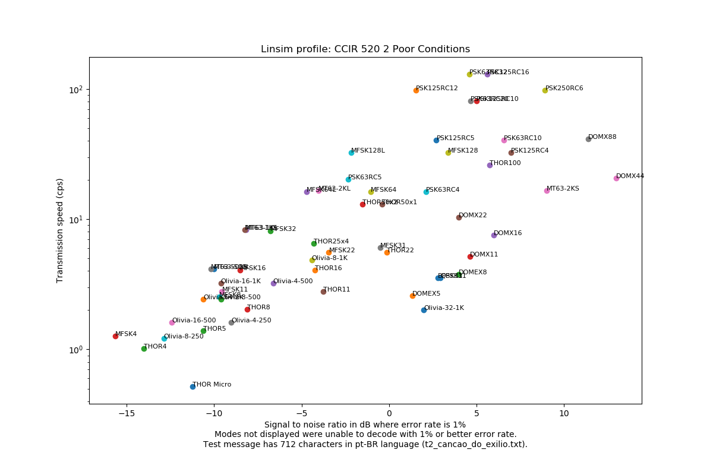
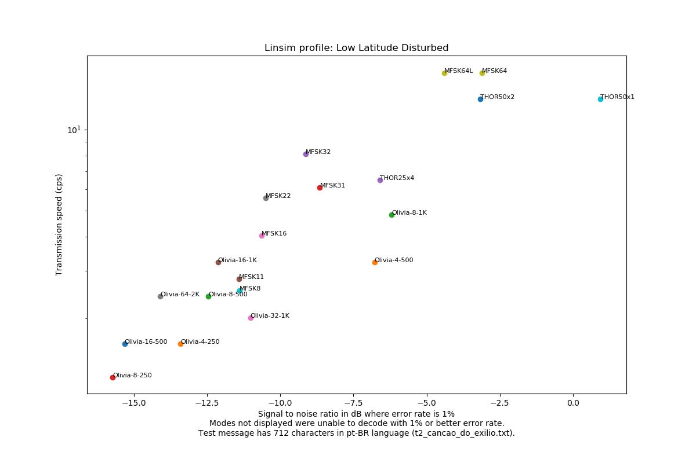
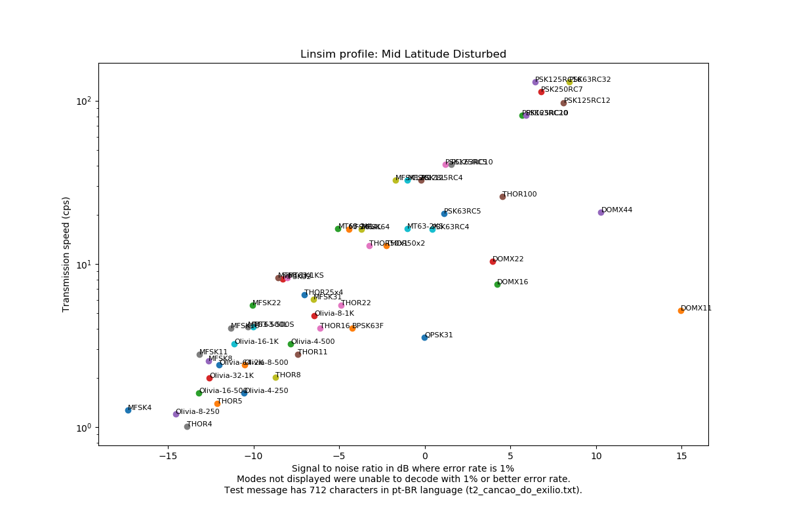
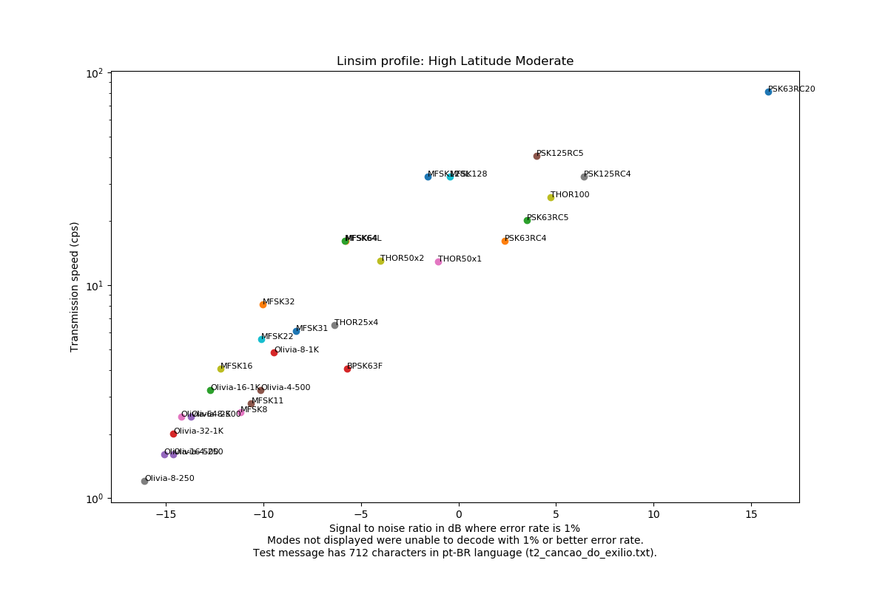
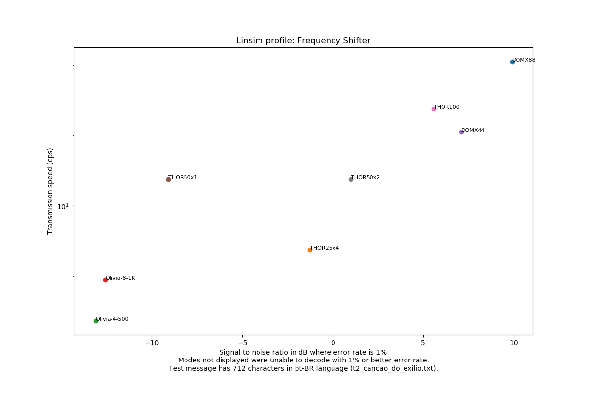

# fldigi_modem_test
Test of the performance of FLDIGI modems under different signal propagation conditions.

## Methodology

Modify FLDIGI to accept more macros and modify linsim to accept more command line options.

Whith the modified versions installed:

* Generate WAVs of a test message with each modem using FLDIGI.
* Simulate propagation conditions using linsim.
* Read back the WAVs generated by linsim using FLDIGI and measure how well the message was received.

The modified versions of linsim and fldigi are in https://github.com/mirandadam/fldigi and https://github.com/mirandadam/linsim.

To replicate any single data point manually on the computer you use with your radio:
* You _do not_ need custom versions of FLDIGI and linsim.
* Get the test data from the files in this repository and paste it as your TX text then add a ^r to the end.
* Configure your transmit mode.
* Use the "TX generate" option to record a wav file. You should do this with your radio off.
* Hit TX. If you remembered to add a ^r to the end of the data FLDIGI will stop transmitting at the end of the message.
* Disable the "TX generate" checkbox.
* Use linsim to generate the effect you want on the audio file you just generated.
* Use the "Playback" option in FLDIGI to try to decode the audio.
* Compare the decoded text with the original test data.

## Results

Raw datapoints in json format: [datapoints.json](results/datapoints.json)

Information about the tested modes in json format: [mode_info.json](results/mode_info.json)

## Caveats

* At this time, test results only have one measure at the conditions of each datapoint. The error rate measured is not precisely repeatable between measurements because of the random nature of noise, more measurements are necessary to increase confidence. Be wary of outliers.
* I recommend you run this in a virtual machine with Ubuntu 18.04.1 since custom versions of FLDIGI and linsim are needed and your FLDIGI configuration may be overwritten.
* This script may overwrite your fldigi configuration (it is not designed to do that, but I may have missed something).
* The behaviour of FLDIGI will be very odd during the simulations - the waterfall will freeze and the text will appear much faster than normal. This is because the scripts uses little known functionality from FLDIGI that allows coding and decoding to happen much faster than the audio output would run (namely WAV_FILE and HS:on macros).
* Tested only on Ubuntu 18.04.1. Results of the performance of the modems should be valid for any installation that FLDIGI runs on.
* The modifications to FLDIGI and linsim were made with care, but this test suite is very hacky. One needs be willing to code and must have at least a basic grasp of python to play with it. Configuration is made by editing the main .py file.
* Test data should have several '===='s in the beginning and several '++++'s in the end. Only the part between the last correctly decoded triplet '===' and the first following triplet '+++' is considered for comparison. This makes it easier to locate the message within the garbage that may come before or after and gives some time for the algorithms with error correction to kick in.
* Since this script uses rarely used features of FLDIGI and a wholly unsupported mode of operation of linsim, several bugs were found. These are quick and dirty notes for me not to forget to document them:
    * fldigi stops HS:on and closes the input file prematurely on MT63 and Olivia playback. The result is that if you are waiting for the file to be closed to run get_rx, you will get an incomplete message, that finishes playing at normal speed.
    * THOR modes somehow give different results from get_rx and the text displayed on the screen (!!!), the beginning of the text usually shows correctly on the RX pane but shows up garbled in get_rx.
    * linsim has a serious issue with batch processing in which the values of the simulation are not updated in time for the simulation to run. The AWGN series mode fixed this by explicitly waiting for the values to be updated. The modified version of linsim includes a patch for that that uses a counter guarded by a pthread lock to keep track of all the pending parameter updates.
