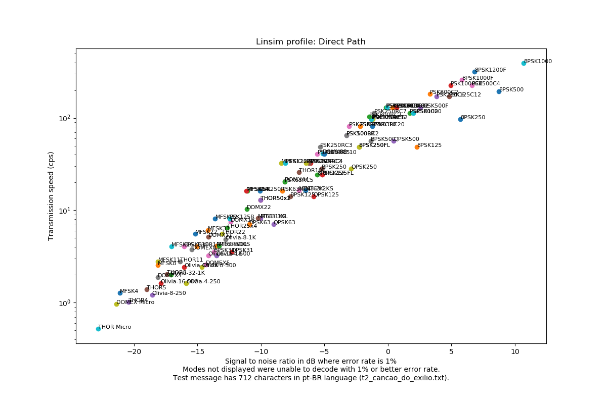
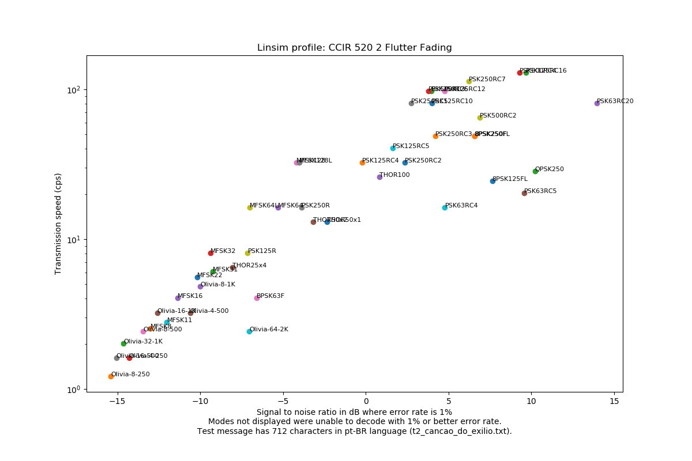
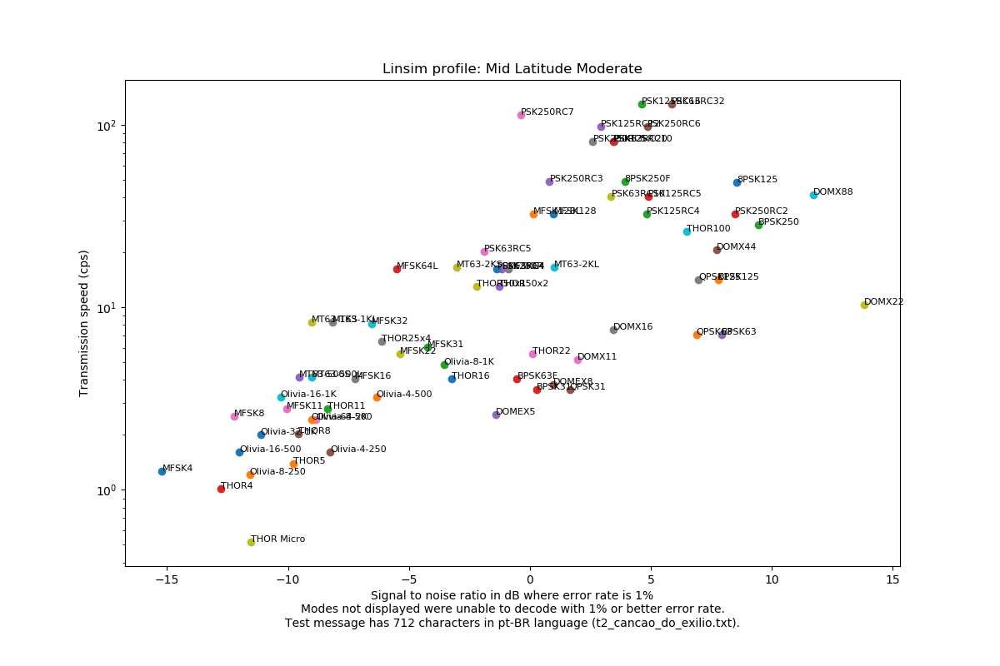
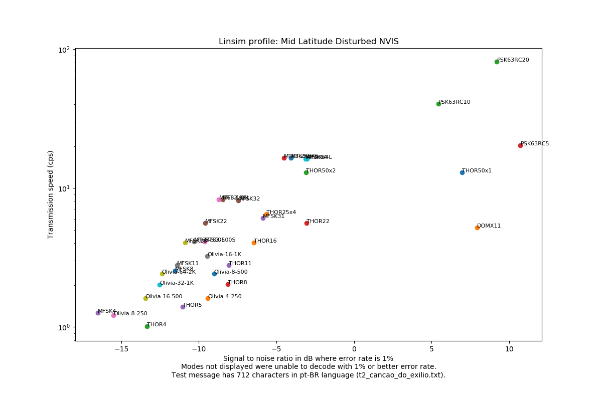

### Mode information

| Mode | Speed (char/s) | Bandwidth 95% power (Hz) | Overhead (s) |
| ---- | -------------- | ------------------ | ------------ |
| BPSK31 | 3.55 | 31.3 | 2.31 |
| BPSK63F | 4.06 | 69.4 | 4.75 |
| BPSK63 | 7.1 | 62.6 | 2.31 |
| BPSK125 | 14.19 | 125.3 | 2.31 |
| BPSK250 | 28.39 | 250.4 | 2.3 |
| BPSK500 | 56.78 | 500.6 | 2.3 |
| BPSK1000 | 113.35 | 1001.1 | 0.51 |
| DOMEX Micro | 0.96 | 34.2 | 9.46 |
| DOMEX4 | 1.88 | 132.8 | 7.4 |
| DOMEX5 | 2.59 | 183.1 | 5.37 |
| DOMEX8 | 3.76 | 265.7 | 3.7 |
| DOMX11 | 5.18 | 183.0 | 2.69 |
| DOMX16 | 7.51 | 265.6 | 1.85 |
| DOMX22 | 10.35 | 366.1 | 1.34 |
| DOMX44 | 20.7 | 1464.7 | 0.67 |
| DOMX88 | 41.41 | 1464.4 | 0.34 |
| MFSK4 | 1.27 | 121.0 | 20.46 |
| MFSK8 | 2.53 | 242.0 | 10.23 |
| MFSK11 | 2.79 | 162.8 | 9.21 |
| MFSK16 | 4.05 | 236.4 | 6.35 |
| MFSK22 | 5.59 | 325.7 | 4.6 |
| MFSK31 | 6.08 | 231.2 | 4.22 |
| MFSK32 | 8.11 | 472.7 | 3.17 |
| MFSK64 | 16.22 | 944.1 | 2.37 |
| MFSK64L | 16.22 | 959.8 | 20.45 |
| MFSK128 | 32.43 | 1879.4 | 1.36 |
| MFSK128L | 32.44 | 1930.4 | 20.23 |
| MT63-500S | 4.13 | 485.5 | 10.33 |
| MT63-500L | 4.13 | 485.8 | 16.73 |
| MT63-1KS | 8.25 | 999.8 | 7.15 |
| MT63-1KL | 8.25 | 999.8 | 10.35 |
| MT63-2KS | 16.51 | 2000.0 | 5.56 |
| MT63-2KL | 16.51 | 2000.0 | 7.16 |
| Olivia-8-250 | 1.21 | 233.1 | 3.3 |
| Olivia-4-250 | 1.61 | 234.6 | 2.47 |
| Olivia-16-500 | 1.61 | 472.8 | 3.51 |
| Olivia-32-1K | 2.01 | 956.0 | 3.63 |
| Olivia-8-500 | 2.42 | 466.2 | 2.67 |
| Olivia-64-2K | 2.42 | 1887.7 | 3.71 |
| Olivia-4-500 | 3.22 | 468.9 | 2.26 |
| Olivia-16-1K | 3.22 | 945.8 | 2.78 |
| Olivia-8-1K | 4.83 | 931.4 | 2.36 |
| PSK125R | 8.11 | 138.8 | 4.55 |
| PSK63RC4 | 16.22 | 309.1 | 2.4 |
| PSK250R | 16.22 | 277.6 | 4.45 |
| PSK63RC5 | 20.27 | 392.9 | 6.89 |
| PSK500R | 32.44 | 550.0 | 4.4 |
| PSK250RC2 | 32.44 | 605.6 | 4.4 |
| PSK125RC4 | 32.44 | 622.5 | 4.4 |
| PSK63RC10 | 40.54 | 808.5 | 3.58 |
| PSK125RC5 | 40.55 | 787.0 | 3.58 |
| PSK250RC3 | 48.66 | 929.3 | 3.02 |
| PSK1000R | 64.88 | 1096.5 | 2.33 |
| PSK500RC2 | 64.88 | 1244.3 | 4.38 |
| PSK125RC10 | 81.07 | 1629.5 | 1.92 |
| PSK63RC20 | 81.07 | 1649.1 | 1.92 |
| PSK250RC5 | 81.1 | 1567.2 | 3.55 |
| PSK500RC3 | 97.32 | 1853.9 | 3.01 |
| PSK250RC6 | 97.32 | 1888.6 | 3.01 |
| PSK125RC12 | 97.35 | 1965.5 | 1.65 |
| PSK800RC2 | 103.81 | 1968.4 | 2.83 |
| PSK250RC7 | 113.53 | 2231.5 | 2.62 |
| PSK500C2 | 113.55 | 1200.2 | 1.28 |
| PSK125RC16 | 129.75 | 2639.1 | 1.3 |
| PSK63RC32 | 129.75 | 2658.9 | 1.3 |
| PSK500RC4 | 129.75 | 2496.4 | 2.32 |
| PSK1000RC2 | 129.76 | 2541.3 | 2.32 |
| PSK250C6 | 170.33 | 1890.4 | 0.94 |
| PSK125C12 | 170.43 | 1954.8 | 0.43 |
| PSK800C2 | 181.68 | 1920.4 | 0.9 |
| PSK1000C2 | 227.1 | 2401.5 | 1.28 |
| PSK500C4 | 227.15 | 2491.9 | 0.77 |
| QPSK31 | 3.55 | 34.1 | 2.31 |
| QPSK63 | 7.1 | 68.1 | 2.31 |
| QPSK125 | 14.19 | 136.3 | 2.31 |
| QPSK250 | 28.39 | 272.7 | 2.3 |
| QPSK500 | 56.78 | 545.4 | 2.3 |
| 8PSK125FL | 24.33 | 137.5 | 4.61 |
| 8PSK125F | 24.33 | 140.2 | 4.61 |
| 8PSK125 | 48.64 | 143.9 | 2.04 |
| 8PSK250FL | 48.65 | 273.3 | 3.26 |
| 8PSK250F | 48.67 | 279.5 | 3.26 |
| 8PSK250 | 97.32 | 284.2 | 1.6 |
| 8PSK500F | 129.75 | 547.7 | 2.04 |
| 8PSK500 | 194.71 | 549.9 | 1.38 |
| 8PSK1000F | 259.55 | 1088.4 | 1.82 |
| 8PSK1200F | 319.44 | 1315.5 | 2.58 |
| 8PSK1000 | 391.79 | 1095.4 | 1.26 |
| THOR Micro | 0.52 | 34.1 | 26.07 |
| THOR4 | 1.01 | 132.9 | 18.21 |
| THOR5 | 1.4 | 183.2 | 13.22 |
| THOR8 | 2.03 | 265.9 | 9.11 |
| THOR11 | 2.79 | 183.3 | 6.61 |
| THOR16 | 4.06 | 266.0 | 4.55 |
| THOR22 | 5.59 | 366.6 | 3.3 |
| THOR25x4 | 6.49 | 1700.1 | 10.77 |
| THOR50x1 | 12.98 | 850.0 | 5.38 |
| THOR50x2 | 12.98 | 1700.0 | 5.38 |
| THOR100 | 25.96 | 1700.0 | 2.69 |

### Scatter plots

#### Linsim profile: Direct Path

---

Modes in the pareto frontier:

| Mode | Speed (cps) | S/N 1% |
| ---- | ----------- | ------ |
| 8PSK1000 | 391.79 | 10.68 |
| 8PSK1200F | 319.44 | 6.83 |
| 8PSK1000F | 259.55 | 5.83 |
| PSK1000C2 | 227.1 | 4.94 |
| PSK800C2 | 181.68 | 3.29 |
| PSK1000RC2 | 129.76 | 0.35 |
| PSK125RC16 | 129.75 | -0.16 |
| PSK250RC7 | 113.53 | -1.09 |
| PSK800RC2 | 103.81 | -1.47 |
| PSK250RC5 | 81.1 | -3.06 |
| PSK500RC2 | 64.88 | -3.26 |
| PSK1000R | 64.88 | -3.27 |
| PSK250RC3 | 48.66 | -5.32 |
| PSK125RC5 | 40.55 | -5.55 |
| MFSK128L | 32.44 | -8.06 |
| MFSK128 | 32.43 | -8.4 |
| MFSK64 | 16.22 | -11.07 |
| MFSK64L | 16.22 | -11.16 |
| PSK125R | 8.11 | -12.47 |
| MFSK32 | 8.11 | -13.59 |
| MFSK31 | 6.08 | -14.17 |
| MFSK22 | 5.59 | -15.15 |
| BPSK63F | 4.06 | -16.05 |
| MFSK16 | 4.05 | -17.02 |
| MFSK11 | 2.79 | -18.09 |
| MFSK8 | 2.53 | -18.13 |
| THOR5 | 1.4 | -19.0 |
| MFSK4 | 1.27 | -21.1 |
| DOMEX Micro | 0.96 | -21.37 |
| THOR Micro | 0.52 | -22.79 |

#### Linsim profile: CCIR 520 2 Good Conditions

---

Modes in the pareto frontier:

| Mode | Speed (cps) | S/N 1% |
| ---- | ----------- | ------ |
| 8PSK1000F | 259.55 | 11.96 |
| PSK500C4 | 227.15 | 8.86 |
| PSK1000C2 | 227.1 | 7.89 |
| PSK1000RC2 | 129.76 | -0.27 |
| PSK500RC4 | 129.75 | -0.55 |
| PSK800RC2 | 103.81 | -1.09 |
| MFSK128L | 32.44 | -4.07 |
| MFSK64L | 16.22 | -4.32 |
| MT63-1KS | 8.25 | -5.02 |
| MT63-500S | 4.13 | -5.42 |
| MT63-500L | 4.13 | -7.04 |
| MFSK11 | 2.79 | -8.28 |
| Olivia-64-2K | 2.42 | -9.16 |
| THOR Micro | 0.52 | -12.12 |

#### Linsim profile: CCIR 520 2 Poor Conditions

---

Modes in the pareto frontier:

| Mode | Speed (cps) | S/N 1% |
| ---- | ----------- | ------ |
| PSK125RC16 | 129.75 | 5.6 |
| PSK63RC32 | 129.75 | 4.58 |
| PSK125RC12 | 97.35 | 1.53 |
| MFSK128L | 32.44 | -2.16 |
| PSK63RC5 | 20.27 | -2.34 |
| MT63-2KL | 16.51 | -4.04 |
| MFSK64L | 16.22 | -4.71 |
| MT63-1KS | 8.25 | -8.26 |
| MT63-500L | 4.13 | -10.01 |
| MT63-500S | 4.13 | -10.2 |
| Olivia-64-2K | 2.42 | -10.61 |
| Olivia-16-500 | 1.61 | -12.42 |
| MFSK4 | 1.27 | -15.64 |

#### Linsim profile: CCIR 520 2 Doppler Fading

---

Modes in the pareto frontier:

| Mode | Speed (cps) | S/N 1% |
| ---- | ----------- | ------ |
| PSK125RC16 | 129.75 | 7.99 |
| PSK500RC4 | 129.75 | 7.9 |
| PSK250RC7 | 113.53 | 5.8 |
| PSK125RC12 | 97.35 | 5.68 |
| PSK250RC6 | 97.32 | 5.63 |
| PSK500RC3 | 97.32 | 4.54 |
| PSK125RC10 | 81.07 | 2.97 |
| PSK250RC3 | 48.66 | 0.36 |
| MFSK128L | 32.44 | -0.79 |
| MT63-2KL | 16.51 | -1.42 |
| MFSK64 | 16.22 | -3.47 |
| MFSK64L | 16.22 | -7.22 |
| Olivia-16-1K | 3.22 | -8.52 |
| Olivia-8-500 | 2.42 | -9.39 |
| Olivia-64-2K | 2.42 | -9.53 |
| THOR5 | 1.4 | -12.05 |
| THOR4 | 1.01 | -12.12 |

#### Linsim profile: CCIR 520 2 Flutter Fading

---

Modes in the pareto frontier:

| Mode | Speed (cps) | S/N 1% |
| ---- | ----------- | ------ |
| PSK125RC16 | 129.75 | 9.68 |
| PSK500RC4 | 129.75 | 9.29 |
| PSK250RC7 | 113.53 | 6.22 |
| PSK125RC12 | 97.35 | 4.76 |
| PSK250RC6 | 97.32 | 3.95 |
| PSK500RC3 | 97.32 | 3.79 |
| PSK250RC5 | 81.1 | 2.74 |
| PSK125RC5 | 40.55 | 1.63 |
| MFSK128L | 32.44 | -4.0 |
| MFSK128 | 32.43 | -4.2 |
| MFSK64 | 16.22 | -5.3 |
| MFSK64L | 16.22 | -7.02 |
| PSK125R | 8.11 | -7.13 |
| MFSK32 | 8.11 | -9.4 |
| MFSK22 | 5.59 | -10.19 |
| MFSK16 | 4.05 | -11.36 |
| Olivia-16-1K | 3.22 | -12.59 |
| MFSK8 | 2.53 | -13.0 |
| Olivia-8-500 | 2.42 | -13.45 |
| Olivia-32-1K | 2.01 | -14.64 |
| Olivia-16-500 | 1.61 | -15.07 |
| Olivia-8-250 | 1.21 | -15.39 |

#### Linsim profile: Low Latitude Moderate

---

Modes in the pareto frontier:

| Mode | Speed (cps) | S/N 1% |
| ---- | ----------- | ------ |
| PSK125RC16 | 129.75 | 8.98 |
| PSK125RC12 | 97.35 | 4.7 |
| PSK125RC10 | 81.07 | 4.0 |
| PSK63RC20 | 81.07 | 3.94 |
| PSK125RC5 | 40.55 | 0.85 |
| MFSK128L | 32.44 | -2.06 |
| MT63-2KL | 16.51 | -5.37 |
| MFSK64L | 16.22 | -5.37 |
| MT63-1KS | 8.25 | -7.52 |
| MT63-1KL | 8.25 | -8.0 |
| MFSK22 | 5.59 | -9.18 |
| MFSK16 | 4.05 | -12.01 |
| MFSK11 | 2.79 | -13.09 |
| MFSK8 | 2.53 | -13.56 |
| Olivia-16-500 | 1.61 | -14.26 |
| MFSK4 | 1.27 | -16.07 |

#### Linsim profile: Low Latitude Disturbed

---

Modes in the pareto frontier:

| Mode | Speed (cps) | S/N 1% |
| ---- | ----------- | ------ |
| MFSK64 | 16.22 | -3.11 |
| MFSK64L | 16.22 | -4.4 |
| MFSK32 | 8.11 | -9.14 |
| MFSK22 | 5.59 | -10.51 |
| MFSK16 | 4.05 | -10.65 |
| Olivia-16-1K | 3.22 | -12.13 |
| Olivia-8-500 | 2.42 | -12.46 |
| Olivia-64-2K | 2.42 | -14.1 |
| Olivia-16-500 | 1.61 | -15.32 |
| Olivia-8-250 | 1.21 | -15.73 |

#### Linsim profile: Mid Latitude Quiet

---

Modes in the pareto frontier:

| Mode | Speed (cps) | S/N 1% |
| ---- | ----------- | ------ |
| PSK500C4 | 227.15 | 14.98 |
| PSK1000C2 | 227.1 | 12.98 |
| PSK125RC16 | 129.75 | 5.85 |
| PSK500RC4 | 129.75 | 4.94 |
| PSK63RC32 | 129.75 | 4.78 |
| PSK250RC7 | 113.53 | -0.08 |
| PSK800RC2 | 103.81 | -0.12 |
| MFSK128L | 32.44 | -1.51 |
| MT63-2KL | 16.51 | -3.73 |
| MFSK64L | 16.22 | -6.28 |
| MT63-1KS | 8.25 | -8.07 |
| MT63-1KL | 8.25 | -8.34 |
| MT63-500S | 4.13 | -9.23 |
| MT63-500L | 4.13 | -10.23 |
| MFSK11 | 2.79 | -10.87 |
| MFSK8 | 2.53 | -11.29 |
| Olivia-16-500 | 1.61 | -11.35 |
| MFSK4 | 1.27 | -14.79 |

#### Linsim profile: Mid Latitude Moderate

---

Modes in the pareto frontier:

| Mode | Speed (cps) | S/N 1% |
| ---- | ----------- | ------ |
| PSK125RC16 | 129.75 | 4.61 |
| PSK250RC7 | 113.53 | -0.37 |
| PSK63RC5 | 20.27 | -1.89 |
| MT63-2KS | 16.51 | -3.04 |
| MFSK64L | 16.22 | -5.52 |
| MT63-1KS | 8.25 | -9.02 |
| MT63-500S | 4.13 | -9.53 |
| Olivia-16-1K | 3.22 | -10.31 |
| MFSK8 | 2.53 | -12.24 |
| MFSK4 | 1.27 | -15.21 |

#### Linsim profile: Mid Latitude Disturbed

---

Modes in the pareto frontier:

| Mode | Speed (cps) | S/N 1% |
| ---- | ----------- | ------ |
| PSK125RC16 | 129.75 | 6.45 |
| PSK63RC20 | 81.07 | 5.91 |
| PSK125RC10 | 81.07 | 5.69 |
| PSK125RC5 | 40.55 | 1.21 |
| MFSK128L | 32.44 | -1.0 |
| MFSK128 | 32.43 | -1.71 |
| MT63-2KL | 16.51 | -5.07 |
| MT63-1KS | 8.25 | -8.02 |
| MT63-1KL | 8.25 | -8.56 |
| MFSK22 | 5.59 | -10.05 |
| MT63-500L | 4.13 | -10.34 |
| MFSK16 | 4.05 | -11.34 |
| MFSK11 | 2.79 | -13.16 |
| Olivia-16-500 | 1.61 | -13.19 |
| MFSK4 | 1.27 | -17.34 |

#### Linsim profile: Mid Latitude Disturbed NVIS

---

Modes in the pareto frontier:

| Mode | Speed (cps) | S/N 1% |
| ---- | ----------- | ------ |
| PSK63RC20 | 81.07 | 9.21 |
| PSK63RC10 | 40.54 | 5.45 |
| MT63-2KL | 16.51 | -4.51 |
| MT63-1KS | 8.25 | -8.71 |
| MFSK22 | 5.59 | -9.59 |
| MT63-500S | 4.13 | -9.64 |
| MT63-500L | 4.13 | -10.3 |
| MFSK16 | 4.05 | -10.89 |
| MFSK11 | 2.79 | -11.39 |
| MFSK8 | 2.53 | -11.55 |
| Olivia-64-2K | 2.42 | -12.39 |
| Olivia-32-1K | 2.01 | -12.52 |
| Olivia-16-500 | 1.61 | -13.45 |
| MFSK4 | 1.27 | -16.51 |

#### Linsim profile: High Latitude Moderate

---

Modes in the pareto frontier:

| Mode | Speed (cps) | S/N 1% |
| ---- | ----------- | ------ |
| PSK63RC20 | 81.07 | 15.86 |
| PSK125RC5 | 40.55 | 3.99 |
| MFSK128L | 32.44 | -1.57 |
| MFSK64 | 16.22 | -5.79 |
| MFSK64L | 16.22 | -5.82 |
| MFSK32 | 8.11 | -10.03 |
| MFSK22 | 5.59 | -10.11 |
| MFSK16 | 4.05 | -12.2 |
| Olivia-16-1K | 3.22 | -12.73 |
| Olivia-8-500 | 2.42 | -13.71 |
| Olivia-64-2K | 2.42 | -14.22 |
| Olivia-32-1K | 2.01 | -14.61 |
| Olivia-16-500 | 1.61 | -15.09 |
| Olivia-8-250 | 1.21 | -16.1 |

#### Linsim profile: High Latitude Disturbed

---

Modes in the pareto frontier:

| Mode | Speed (cps) | S/N 1% |
| ---- | ----------- | ------ |
| MFSK64L | 16.22 | -4.08 |
| MFSK64 | 16.22 | -4.11 |
| MFSK32 | 8.11 | -7.05 |
| THOR25x4 | 6.49 | -8.18 |
| Olivia-16-1K | 3.22 | -11.26 |
| Olivia-8-500 | 2.42 | -12.0 |
| Olivia-64-2K | 2.42 | -13.26 |
| Olivia-32-1K | 2.01 | -14.12 |
| Olivia-16-500 | 1.61 | -14.46 |

#### Linsim profile: Frequency Shifter

---

Modes in the pareto frontier:

| Mode | Speed (cps) | S/N 1% |
| ---- | ----------- | ------ |
| DOMX88 | 41.41 | 9.91 |
| THOR100 | 25.96 | 5.58 |
| THOR50x2 | 12.98 | 0.98 |
| THOR50x1 | 12.98 | -9.1 |
| Olivia-8-1K | 4.83 | -12.59 |
| Olivia-4-500 | 3.22 | -13.13 |

